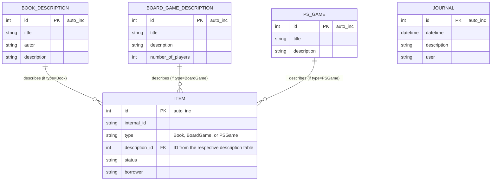

# Inventory Management System Documentation

This document outlines the database schema and system processes for the inventory management system handling Books, Board Games, and PlayStation Games.

---

## 1. Database Model (Entity-Relationship Diagram)

The database uses a polymorphic relationship in the `ITEM` table to link physical instances to their respective metadata tables based on the `type` field.

