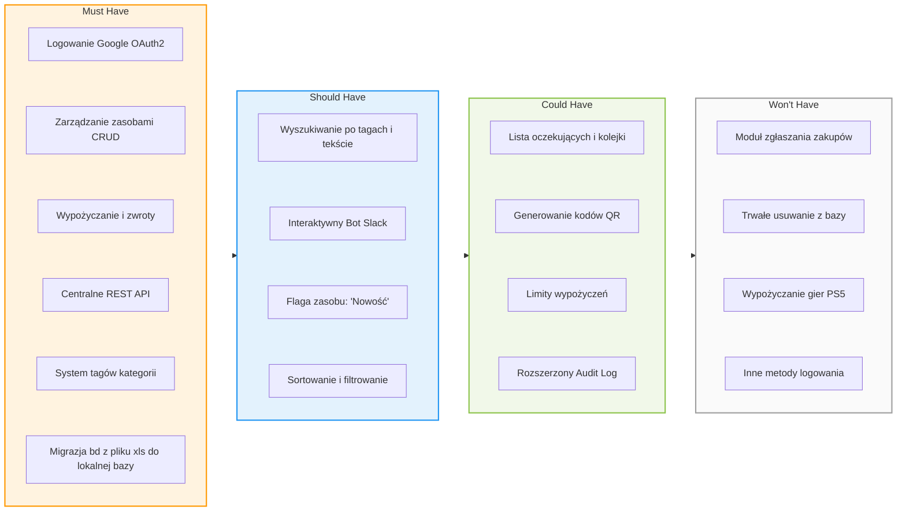
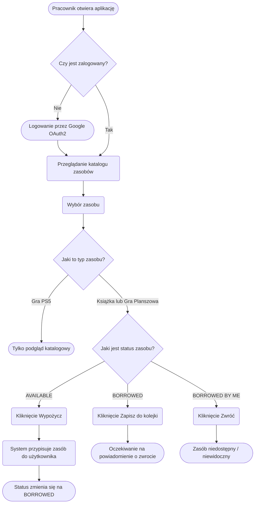
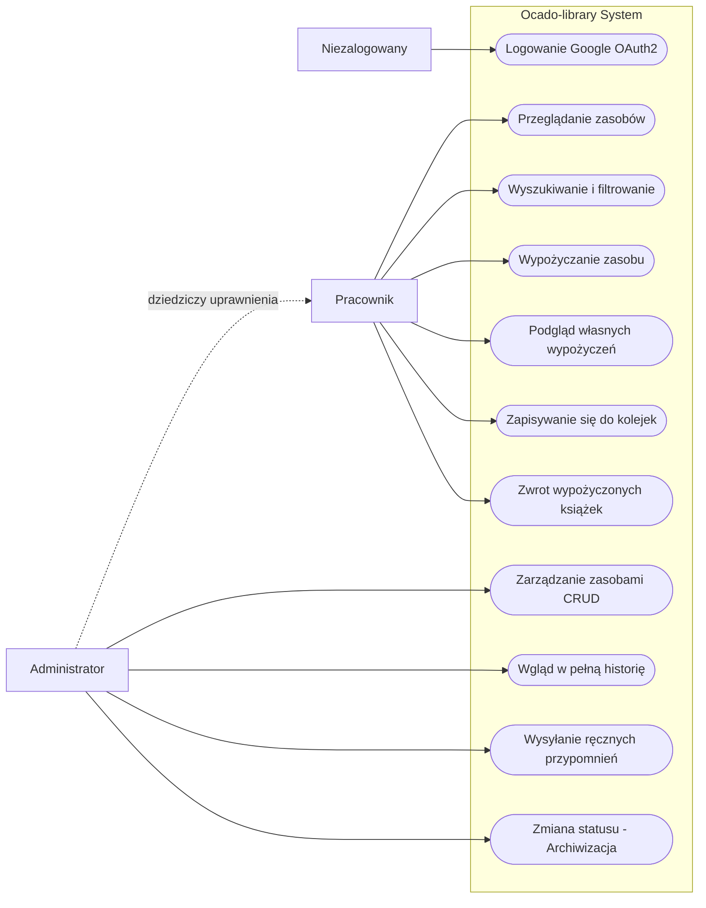
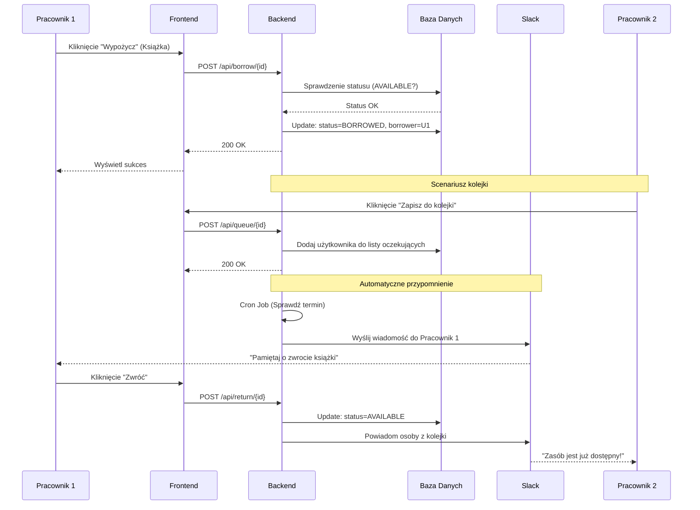

# Dokumentacja Projektu: Ocado-library

System zarządzania zasobami bibliotecznymi (książki, gry planszowe, gry PS5).

---

## 1. Priorytetyzacja wymagań (MoSCoW)

Poniższa tablica Kanban przedstawia podział funkcjonalności według ich ważności dla projektu. 

  

## 2. Przepływ procesu (Flowchart)

  

Diagram przedstawia ścieżkę użytkownika od wejścia do aplikacji po interakcję z konkretnym typem zasobu.

  

  

## 3. Diagram przypadków użycia (Use Case Diagram)

  

Podział uprawnień i dostępnych akcji dla poszczególnych ról w systemie.

  

  

## 4. Interakcje w systemie (Sequence Diagram)

  

Przykładowy scenariusz: wypożyczenie przez jednego użytkownika, zapisanie się do kolejki przez drugiego oraz system powiadomień Slack.

  

