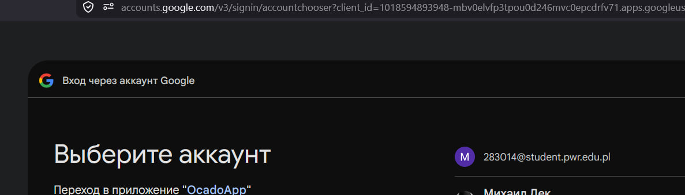
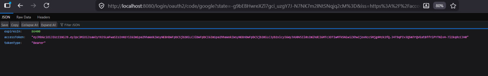

# Logowanie przez Google i JWT

Dokument opisuje konfigurację logowania Google OAuth2 + JWT w `backend_api/` (port 8080) i integrację z frontendem Vite (port 5173).

---

## Jak to działa (frontend)

1. Użytkownik otwiera `http://localhost:5173/login` i klika **Continue with Google**.
2. Przeglądarka przechodzi przez proxy Vite na `http://localhost:8080/oauth2/authorization/google`.
3. Po logowaniu w Google backend przekierowuje na `http://localhost:5173/auth/callback#access_token=...`.
4. Frontend zapisuje JWT i woła `GET /api/me` z nagłówkiem `Authorization: Bearer <token>`.
5. Kolejne requesty do API używają tego samego nagłówka Bearer.

**Plan B (test API bez frontu):** po OAuth w tej samej przeglądarce otwórz `http://localhost:8080/api/auth/token` — JSON z `accessToken` (sesja cookie).

Serwer nie przechowuje listy tokenów. Weryfikuje podpis i datę ważności przy każdym requeście. W JWT są m.in. `email` i `roles` (`USER` / `ADMIN`).

---

## Terminy

| Termin | Znaczenie |
|--------|-----------|
| **OAuth / Google login** | Google potwierdza tożsamość i przekazuje e-mail do backendu |
| **`code` w URL callback** | Jednorazowy kod w `/login/oauth2/code/google?code=...` — nie jest tokenem API |
| **`accessToken`** | JWT do API (zaczyna się od `eyJ...`) |
| **Bearer** | Nagłówek: `Authorization: Bearer <token>` |
| **USER** | Dostęp do `GET /api/**` |
| **ADMIN** | Dodatkowo `POST` / `PUT` / `DELETE` — e-mail na liście `app.security.admin-emails` |

---

## Komponenty

| Miejsce | Rola |
|---------|------|
| [Google Cloud Console](https://console.cloud.google.com/) | Client ID, Client Secret, redirect URI |
| `backend_api/` | OAuth, wystawianie JWT, ochrona API |
| `frontend/` | Logowanie Google, przechowywanie JWT, `GET /api/me` |

---

## 1. Google Cloud Console

### Projekt

[console.cloud.google.com](https://console.cloud.google.com/) → **New Project**.

### OAuth consent screen

**APIs & Services** → **OAuth consent screen** → typ **External**.

Scopes: `openid`, `email`, `profile`.

W trybie **Testing** dodaj adresy w **Test users** (tylko te konta mogą się logować).

### OAuth client ID

**Credentials** → **OAuth client ID** → **Web application**.

**Authorized redirect URIs:**

```text
http://localhost:8080/login/oauth2/code/google
```

Błąd `redirect_uri_mismatch` oznacza inny adres lub port w Console.

Opcjonalnie **JavaScript origins:** `http://localhost:8080`, `http://localhost:5173`.

Zapisz **Client ID** i **Client secret** — poza repozytorium (`.env`).

---

## 2. Konfiguracja `backend_api`

### `.env`

```properties
GOOGLE_CLIENT_ID=...
GOOGLE_CLIENT_SECRET=...
JWT_SECRET=...   # min. 32 znaków
FRONTEND_URL=http://localhost:5173
POSTGRES_USER=...
POSTGRES_PASSWORD=...
POSTGRES_DB=...
```

Opcjonalnie:

```properties
JWT_SECRET=losowy-sekret-minimum-32-znaki
```

### `application.yml`

- Google: `client-id`, `client-secret`, redirect na port 8080
- JWT: `app.jwt.secret`, `app.jwt.expiration-hours: 24`
- Admini: `app.security.admin-emails` (lista po przecinku)

Dowolny zweryfikowany e-mail Google może się zalogować. Filtr domeny `@ocado.com` — planowany później (koniec dokumentu).

### Start

```bash
cd backend_api
mvn clean spring-boot:run
```

Wymagana działająca baza PostgreSQL (`database/docker-compose.yml`).

---

## 3. Test w przeglądarce

### Start logowania

Nowa karta, adres:

```text
http://localhost:8080/oauth2/authorization/google
```

Nie używaj ponownie starego URL z parametrem `code`.

### Wybór konta Google



Przy odmowie: konto na liście **Test users** w Consent screen.

### Callback

Po logowaniu przeglądarka trafia na:

```text
http://localhost:8080/login/oauth2/code/google?state=...&code=...
```

Parametr `code` jest jednorazowy — backend wymienia go z Google w tle.

### Odpowiedź z tokenem

```json
{
  "accessToken": "eyJhbGciOiJIUzI1NiJ9....",
  "tokenType": "Bearer",
  "expiresIn": 86400
}
```




Token to wartość **`accessToken`**. `expiresIn: 86400` — 24 godziny.

Alternatywa po udanym logowaniu w tej samej przeglądarce: `http://localhost:8080/api/auth/token`.

---

## 4. Przepływ w backendzie

```text
/oauth2/authorization/google
  → Google (login)
  → /login/oauth2/code/google
  → LibraryOidcUserService (e-mail, opcjonalnie ADMIN)
  → JwtAuth (podpis JWT)
  → JSON z accessToken
```

Kolejne żądania do `/api/**` wymagają nagłówka Bearer. Sam adres w pasku przeglądarki, np. `/api/descriptions/Book/all`, zwróci 401 — bez nagłówka JWT.

Sprawdzenie tokenu: `SecurityConfig` (resource server + reguły ról). E-mail w logice: `CurrentUser.email()`.

---

## 5. Pliki

| Plik | Rola |
|------|------|
| `application.yml` | Google, JWT, admin-emails |
| `.env` | Sekrety |
| `SecurityConfig.java` | OAuth, JSON po logowaniu, Bearer JWT |
| `LibraryOidcUserService.java` | Walidacja użytkownika Google, ADMIN |
| `JwtAuth.java` | Tworzenie JWT |
| `AuthController.java` | `GET /api/me`, `GET /api/auth/token` |
| `CurrentUser.java` | E-mail z JWT w kontrolerach |

---

## Problemy

| Objaw | Rozwiązanie |
|--------|-------------|
| `redirect_uri_mismatch` | Redirect URI = `http://localhost:8080/login/oauth2/code/google` |
| Brak ekranu Google | Konto w **Test users** |
| 500 po logowaniu | `mvn clean spring-boot:run`, logi w terminalu |
| Stary `code` w URL | Od nowa `/oauth2/authorization/google` |
| 401 na API | Brak `Authorization: Bearer` |
| 403 na POST | Brak roli ADMIN w `admin-emails` |

---

## Frontend

`frontend/` używa mock logowania. Planowana integracja: przekierowanie na OAuth, zapis `accessToken`, `fetch` z nagłówkiem Bearer.

---

## Później: domena `@ocado.com`

Obecnie brak filtra firmowej domeny — testy na dowolnym Gmailu.

Planowane: ograniczenie e-maili do `@ocado.com` w OIDC, osobny klient OAuth na produkcji, aktualizacja frontendu. Po wdrożeniu — aktualizacja tego dokumentu i `application.yml`.

---

## Skrót

1. Google Console: Client ID, redirect na 8080, Test users.
2. `backend_api/.env`, `mvn spring-boot:run`.
3. `http://localhost:8080/oauth2/authorization/google`.
4. Skopiuj `accessToken` z JSON.
5. API: nagłówek `Authorization: Bearer <token>`.

*Maj 2026 — backend_api, JWT (jjwt).*
