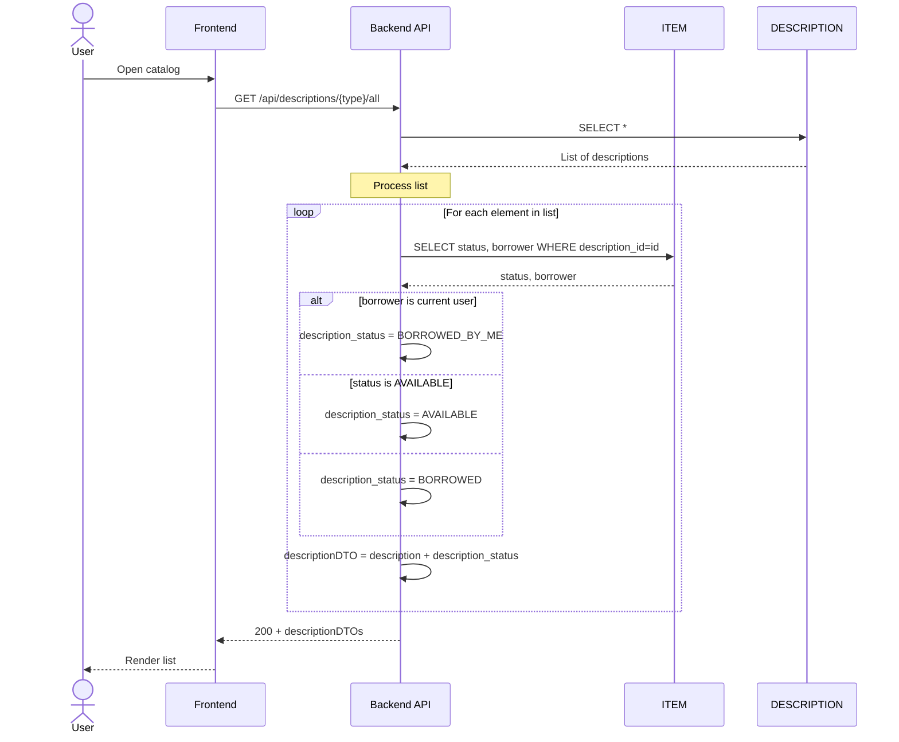
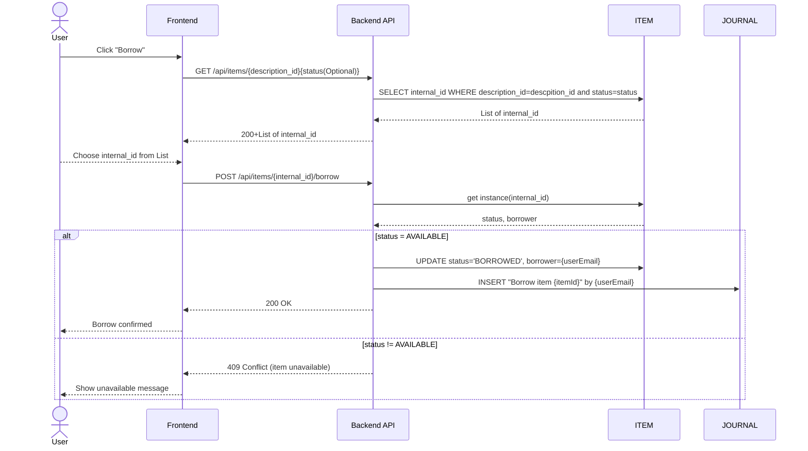
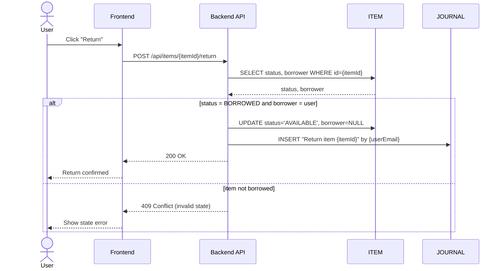
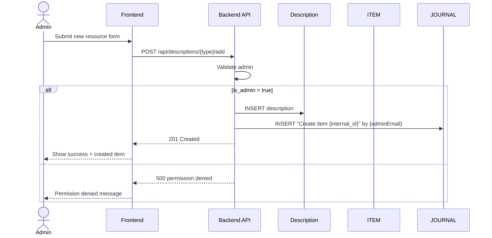
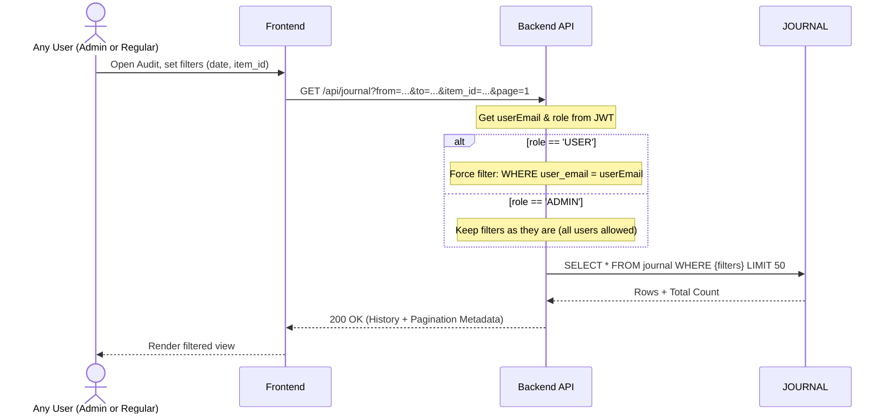

# Sequence Diagrams - Ocado-library

This file contains normalized sequence diagrams aligned with the current data model from `docs/database_model.md`.

## System Context

The diagrams reflect these core entities:

- `ITEM` (physical copy with `type`, `status`, `borrower`),
- metadata tables: `BOOK_DESCRIPTION`, `BOARD_GAME_DESCRIPTION`, `PS_GAME`,
- `JOURNAL` for audit events.

## 1. Catalog View

User opens the catalog and then opens details of one specific item.  
Backend resolves metadata table based on `ITEM.type`.

## 2. Borrow Item

User borrows a currently available item.  
System writes both `ITEM` status change and audit row in `JOURNAL`.

## 3. Return Item

Borrower (or admin) returns the item.  
Status becomes available and audit event is stored.

## 4. Admin Creates New Physical Item

Admin first creates metadata, then creates a physical `ITEM` pointing to that metadata (`description_id`).

## 5. Audit Log View

Admin opens complete system history based on `JOURNAL`.

## Notes

- Mermaid participants use short aliases for stable rendering.
- Endpoint names are examples and can be mapped to your real API routes.
- Queue/waitlist and Slack notifications are not part of the current database model, so they are intentionally excluded here.
